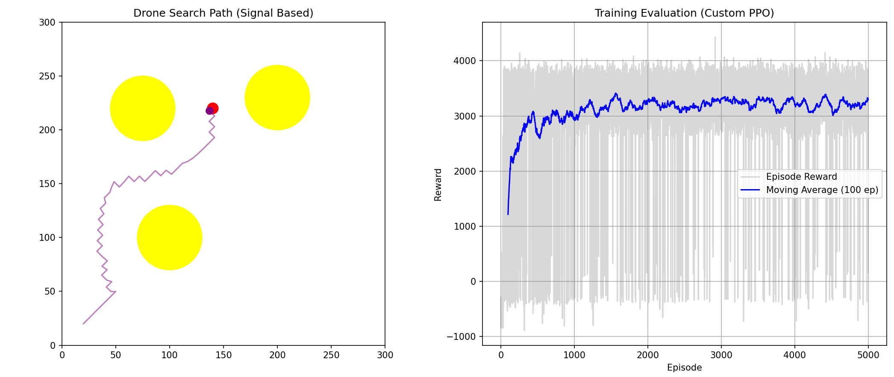
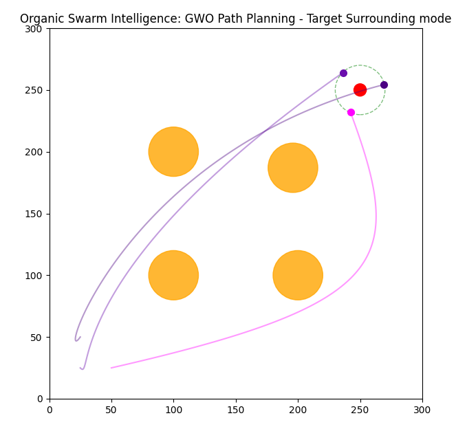

    
    

    
 
    <h2 style="border-bottom: 1px solid #21262d; color: #c9d1d9;">  </h2>  
    
  
 
    

    

    <h2 style="border-bottom: 1px solid #21262d; color: #c9d1d9;"> 🛠️ Tech Stacks </h2>   
    
 
          
          

    

    
 
    <h2 style="border-bottom: 1px solid #21262d; color: #c9d1d9;"> 🏅 Stats </h2> 
   
 
    

## 🚁 Drone Simulation

## PPO Search for Signal Source Based RSSI

## 🔧 Tech
Python / PyTorch / gymnasium

## PPO Ver.2

## 🔧 Tech
Python / PyTorch / gymnasium

## GWO

## 🔧 Tech
Python / PyTorch

<!--
**raccoon297/raccoon297** is a ✨ _special_ ✨ repository because its `README.md` (this file) appears on your GitHub profile.

Here are some ideas to get you started:

- 🔭 I’m currently working on ...
- 🌱 I’m currently learning ...
- 👯 I’m looking to collaborate on ...
- 🤔 I’m looking for help with ...
- 💬 Ask me about ...
- 📫 How to reach me: ...
- 😄 Pronouns: ...
- ⚡ Fun fact: ...
-->
